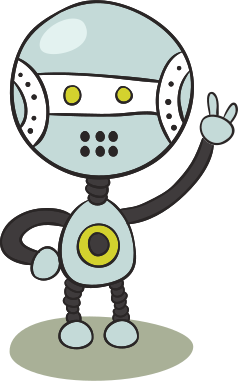
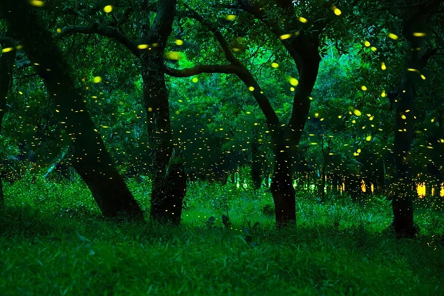
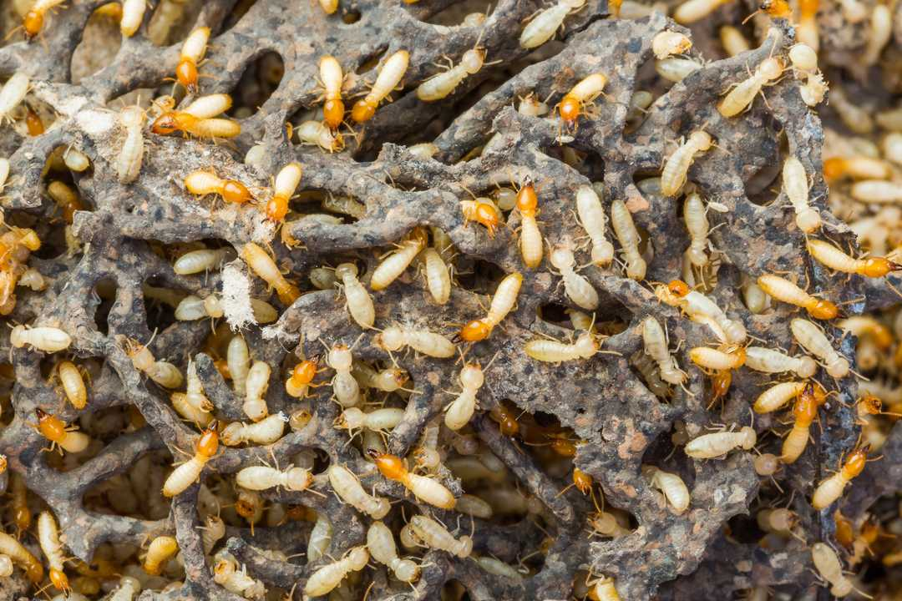
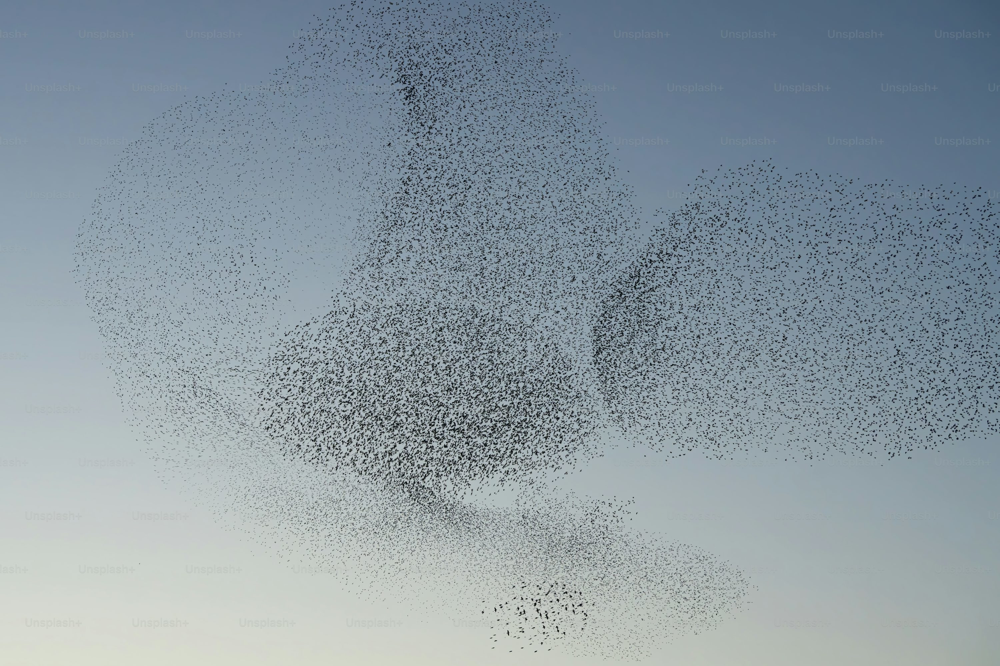

+++
title = "Ecosistemi coordinati di robot programmabili"
outputs = ["Reveal"]
+++

# Ecosistemi coordinati  di robot programmabili

Gianluca Aguzzi, Martina Baiardi, Roberto Casadei,  
Davide Domini, Nicolas Farabegoli, Danilo Pianini, Mirko Viroli

---

{}{}

{}{}

{}{}

{}{}

{}{}

{}{}

    
---

<iframe width="100%" height="1000px" loading="eager" autoplay="true" src="https://lumasky.show/wp-content/uploads/personal/oblozhka2.html?autoplay=1&controls=0&loop=1&modestbranding=1&mute=1&showinfo=0" ></iframe> 

---

<iframe width="100%" height="900px" loading="eager" autoplay="true" src="https://www.youtube.com/embed/qy4_3qJbLeA?si=P2jwvfj6-YR9CujO?autoplay=1" frameborder="0"></iframe>

---

## Una piccola dimostrazione

{}{}

{}{}

Abbiamo un robot speciale chiamato **leader**, che *guida* gli altri, ottenendo un **sistema auto-organizzante**:

1. Tutti i robot puntano verso la stessa direzione
2. Tutti i robot puntano verso il leader
3. I robot "danzano" in modo coordinato, raggiungendo la stessa direzione puntata dal leader
4. Formazioni di semplici strutture: tutti i robot si dispongono in linea e in cerchio rispetto al leader.

{}{}

---

# Un nostro simulatore: MacroSwarm

      
      
      
      
      
      
      
      

