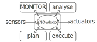
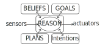

+++
title = "Supporting Autonomic Computing via BDI Tooling"
outputs = ["Reveal"]
+++

# Supporting Autonomic Computing 
# via BDI Tooling

<br>

Martina Baiardi

<small>Department of Computer Science and Engineering (DISI)<br>
Alma Mater Studiorum — Università di Bologna <br>
Via dell’Università 50, 47522 Cesena (FC), Italy </small>

---

## Context
#### Autonomic Computing

<br/>

{}{}



<div class="mx-5 text-center">

## *<i class="fa-solid fa-arrow-up"></i> MAPE-K* 
Reference <u>model</u> for *Autonomic* and *self-\** systems design. 

</div>

{}{}

<div class="mx-5 text-center">

{}



## *<i class="fa-solid fa-arrow-up"></i> BDI* 
Reference <u>framework</u> (*AgentSpeak(L)*) for *Multi-Agent Systems*. 

{}

</div>

{}{}

{}
<div class="position-absolute">
<iframe src="https://giphy.com/embed/g01ZnwAUvutuK8GIQn" width="100%" height="100%" frameBorder="0" class="fixed-top" allowFullScreen></iframe>

<div class="fixed-top " style="color:white">

<h2 style="color:white"> Why isn't BDI common in autonomic loops? </h2>

</div>

</div>
{}

---

# BDI?

## Beliefs, Desires, Intentions

<br />

- It's a framework to model Multi-Agent Systems through *Goals*
- Reduces the *abstraction gap* between *cognitive abstractions* and the abstractions of common paradigms
  - Mimicking human-level notions such as *beliefs*, *desires* and *intentions*

### three main abstractions:

- *Beliefs*: mental state of the agent, that changes over time.
- *Desires*: motivational state of the system.
- *Intentions*: deliberative state of the agent.

<div>
<br />

<small style="text-align: left"> 
--- <br/>
[1] Bratman, Michael. "Intention, plans, and practical reason." (1987) <br />
[2] Anand S. Rao and Michael P. Georgeff. "BDI agents: From theory to practice." (1995) <br />
[3] Anand S. Rao. "Agentspeak(l): BDI agents speak out in a logical computable language." (1996) 
</small>
</div>


---

## AgentSpeak(L) under the hood...


---

# MAPE-K vs. BDI: Key differences

### Conceptual vs. practical

* **MAPE-K** defines a conceptual model, needs application-specific implementations
    * favors ad-hoc implementations
* **BDI** is typically reified into a practical tool (a language or library)
    * enforces commitment to a technology

### Architectural vs. formal

* **MAPE-K** defines a reasoning architecture and a loop scheme
* **BDI** has been formalised into AgentSpeak(L)
    * Typical implementations adhere to the formal specification

### Simple vs. complex

* **MAPE-K** is simpler
    * can be implemented on a per-application basis
* **BDI** requires complex matching ad plan-selection algorithms
    * hard to build from scratch in a custom fashion

---

# BDI Agent Programming Languages
{}

### ... some of them

{}

<br />



<br />

<div>
<small style="text-align: left"> 
[1] Collier, R.W., Russell, S.E., Lillis, D.. "Reflecting on agent programming with AgentSpeak(L). I" (2015) <br />
[2] Hindriks, K.V.. "Programming rational agents in GOAL." (2009) <br />
[3] Pokahr, A., Braubach, L., Lamersdorf, W.. "Jadex: A BDI reasoning engine." (2005) <br />
[4] Bordini, R.H., Hübner, J.F., Wooldridge, M.J.. "Programming Multi-Agent Systems in AgentSpeak using Jason." (2007) <br />
[5] D’Urso, F., Longo, C.F., Santoro, C.. "Programming intelligent iot systems with a python-based declarative tool." (2019) <br />
[6] Palanca, J., Rincon, J.A., Carrascosa, C., Julián, V., Terrasa, A.. "A flexible agent architecture in SPADE." (2022)
</small>
</div>

---

# Majority of BDI tools: Libraries

<br>
<br>

{} 

* Built for mainstream languages
* Subject to the *syntactic restrictions* of their host language
  * "True" AOP/BDI feeling hardly achieved






## <i class="fa-solid fa-arrow-right"></i> *custom language*


 {}

---

# AOP Custom Languages

<div>

<div class=" w-50 m-auto text-right" style="text-align: left">

<i class="fa-solid fa-check" style="color: green; margin-right: 10px"></i>
Great ergonomy for BDI AOP (made by purpose)

<i class="fa-solid fa-xmark" style="color: red; margin-right: 10px"></i>
BDI-specific, not multi-paradigm 

<i class="fa-solid fa-xmark" style="color: red; margin-right: 10px"></i>
Steep learning curve

<i class="fa-solid fa-xmark" style="color: red; margin-right: 10px"></i>
Require custom tooling - IDEs, code suggestions, syntax highlighters, linters...

<i class="fa-solid fa-xmark" style="color: red; margin-right: 10px"></i>
Small community

<i class="fa-solid fa-xmark" style="color: red; margin-right: 10px"></i>
High maintenance cost!

</div>

---

# A hybrid approach

 

---

# JaKtA: <br> <u>Ja</u>son-like <u>K</u>o<u>t</u>lin <u>A</u>gents [1]

Internal Domain-Specific Language (DSL) implemented in Kotlin

* Multi-paradigm support: OOP + FP + BDI AOP
* Hosted on a mainstream language: gentle learning curve
  * Great learning resources for Kotlin
  * Significantly large community for help
* Reuses the entire existing Kotlin toolchain
  * Developed and *maintained* by the language maintainers and the community
  * Maintenance is greatly reduced
* Good ergonomy

<br />
<br />

<div>
<small style="text-align: left"> 
---<br/>
[1] Baiardi, M., Burattini, S., Ciatto, G., & Pianini, D. (2023, September). JaKtA: BDI Agent-Oriented Programming in Pure Kotlin. 
</small>
</div>

---

# Why kotlin?
<br>

{}{}
* Natively multi-paradigm (OOP + FP)
* Statically typed
  * With a good IDE, helps understanding what can be written where
* Direct support to internal DSLs
  * a.k.a "Type-safe builders" in the Kotlin documentation
* Support for multiplatform development
{}



* Growing community
  * Strongly pushed by Google for Android


{}{}


---

## Jakta: multi-paradigm AOP/BDI+OOP+FP


```kotlin
mas {                                                   // BDI specification
  fun allPlayers(team: String) =
    Regex("""<a\s(\X*?)\sdata-cy="player">(.*)<\/a>""") // Object-oriented regex library
        .findAll(URL("https://www.besoccer.com/team/squad/$team").readText())
        .map { team to it.groupValues[2] }              // Lambda expression (Functional style)

  listOf("napoli", "milan", "internazionale")           // Kotlin standard library
      .flatMap(::allPlayers)                            // Higher-order function (Functional style)
      .forEach { (team, player) ->                      // Destructuring declaration
          agent(player) {
              beliefs { fact { squad(team) } }
              goals { achieve(start) }
              plans {
                  +achieve(start) onlyIf { squad(S).fromSelf } then {
                      execute(print("Hello! I play for", S))
                  }
              }
          }
      }
}.start()
```

---

## Future work
JaKtA is still in its early stages, in the future we plan to: 
* Provide stable tools to emulate dynamic environments (**Simulation**)
    * Validate the integration with an application, e.g.: drone swarm coordination (**Use case**) 
* Expose BDI abstractions within the debugger for helping bug inspection (**Debug**)
* Use BDI abstractions in small fragments of non-BDI programs (**Bidirectional paradigm blending**)
    * (we can already use fragments of functional and OOP inside a BDI program)

---

# try jakta
<br>

[github.com/jakta-bdi/jakta-examples](https://github.com/jakta-bdi/jakta-examples)


